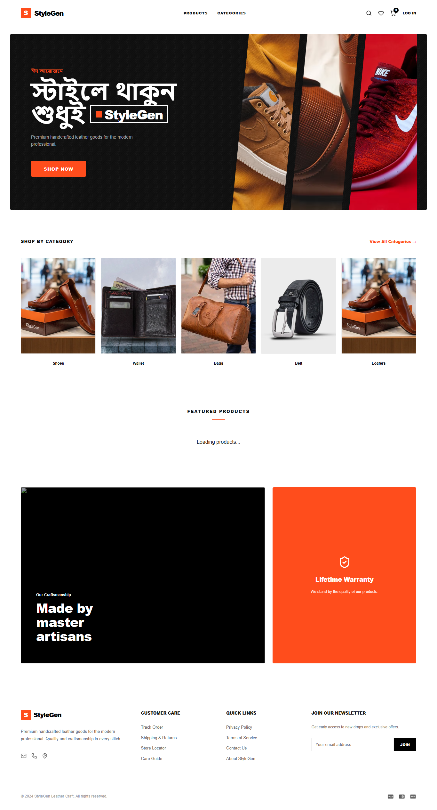

#  Rj StyleGen

Rj StyleGen is a full-stack web application that helps users generate and explore personalized style recommendations. The project is built with a modern React frontend and a Node.js/Express backend, with MongoDB used for data management.

## 🚀 Live Demo

👉 [Rj StyleGen](https://rj-style-gen.vercel.app/)

## 📸 Project Overview




## 🛠️ Technology Stack

### Frontend

* React
* Vite
* JavaScript
* React Router
* Axios
* Lucide React

### Backend

* Node.js
* Express.js
* MongoDB
* Mongoose
* JWT Authentication
* bcrypt
* Multer
* CORS
* dotenv

### Payment

* SSLCommerz

## ✨ Key Features

* 👕 Style generation and recommendation
* 🔐 User authentication and authorization
* 👤 User account management
* 🖼️ Image/file upload support
* 💾 MongoDB-based data management
* 🔄 REST API communication between frontend and backend
* 💳 Payment integration with SSLCommerz
* 🧭 Client-side routing with React Router
* 📱 Responsive and modern user interface

## 📦 Dependencies

### Frontend

* `react`
* `react-dom`
* `react-router-dom`
* `axios`
* `lucide-react`
* `vite`

### Backend

* `express`
* `mongoose`
* `bcrypt`
* `jsonwebtoken`
* `multer`
* `cors`
* `dotenv`
* `sslcommerz-lts`

## 💻 Run Locally

### 1. Clone the repository

```bash
git clone https://github.com/mdraju116/Rj-StyleGen.git
cd Rj-StyleGen
```

### 2. Run the Frontend

```bash
cd StyleGenFrontend
npm install
npm run dev
```

The frontend will start using Vite.

### 3. Run the Backend

Open another terminal:

```bash
cd StyleGenBackend
npm install
npm run dev
```

The backend will start using Nodemon.

### 4. Environment Variables

Create a `.env` file inside the `StyleGenBackend` directory and configure the required environment variables.

> Do not commit your `.env` file or expose private API keys, database credentials, JWT secrets, or payment credentials.

## 📂 Project Structure

```text
Rj-StyleGen/
│
├── StyleGenFrontend/
│   ├── public/
│   ├── src/
│   ├── package.json
│   └── vite.config.js
│
└── StyleGenBackend/
    ├── src/
    ├── database.sql
    ├── seed.js
    ├── swagger.yml
    ├── package.json
    └── .env.example
```

## 🔗 Relevant Links

* 🌐 Live Demo: https://rj-style-gen.vercel.app/
* 💻 GitHub Repository: https://github.com/mdraju116/Rj-StyleGen

## 👨‍💻 Author

**Md. Raju Ahammed**

GitHub: https://github.com/mdraju116
